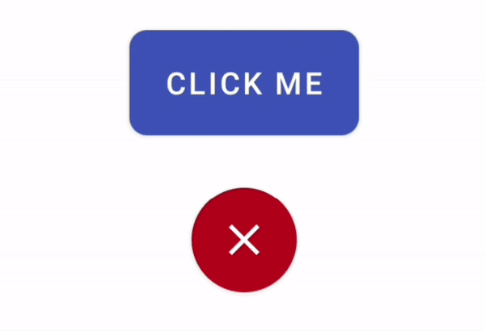

# MorphButton

Inspired by https://github.com/dmytrodanylyk/android-morphing-button

Android Button that morphs to different shapes, derived from MaterialButton & AndroidX

Example


---

### Dependency

Add this to your module's `build.gradle` file (make sure the version matches the last [release](https://github.com/ueen/MorphButton/releases/latest)):

Add it in your root build.gradle at the end of repositories:

```gradle
allprojects {
	repositories {
		...
		maven { url "https://jitpack.io" }
	}
}
```

Add the dependency
```gradle
dependencies {
    // ... other dependencies
    implementation 'com.github.ueen:MorphButton:1.1'
}
```

# Usage

### Declare your button in XML

```xml

<de.ueen.morphbutton.MorphButton
        android:id="@+id/morphButton"
        android:layout_width="wrap_content"
        android:layout_height="48dp"
        android:insetBottom="0dp"
        android:insetTop="0dp"
        android:insetRight="0dp"
        android:insetLeft="0dp"
        app:cornerRadius="24dp"
        app:backgroundColor="#3F51B5"
        android:text="Click Me"/>
```

Here its important, that you set all the insets to 0dp, its a bug in MaterialButton, that otherwise leads to strange behaviour

You can set everything as you need it (like: backgroundColor, icon, cornerRadius, textColor...)

### Morph your button in code

here are a few examples what you can do

```kotlin
        one.setOnClickListener { it, morphId ->
            when(morphId) {
                MorphButton.FRIST -> {
                    it.morph(MorphButton.MorphParams("second",
                                                    circle = true,
                                                    icon = resources.getDrawable(R.drawable.ic_check_black_24dp, null),
                                                    iconSize = it.height/3*2,
                                                    color = getColor(android.R.color.holo_green_light)
                            ))
                }
                else -> {
                    it.reverse()
                }
            }
        }
        two.setOnClickListener { it, morphId ->
            when(morphId) {
                MorphButton.FRIST -> {
                    it.morph(MorphButton.MorphParams("second",
                            width = it.width*3,
                            radius = TypedValue.applyDimension(TypedValue.COMPLEX_UNIT_DIP, 8f, resources.displayMetrics).toInt(),
                            text = "clicked",
                            color = getColor(android.R.color.holo_blue_bright)
                    ))
                }
                "second" -> {
                    it.morph(MorphButton.MorphParams("third",
                            keepText = true,
                            color = getColor(android.R.color.holo_orange_light)
                    ))
                }
                else -> {
                    it.backToFirst()
                }
            }
        }

```
Notice, that you can morph the button from anywhere and also get the current id of the morph the button is in inside the onClickListener, so you can do things accordingly.


License
-------

    Copyright (C) 2020 ueen

    Licensed under the Apache License, Version 2.0 (the "License");
    you may not use this file except in compliance with the License.
    You may obtain a copy of the License at

       http://www.apache.org/licenses/LICENSE-2.0

    Unless required by applicable law or agreed to in writing, software
    distributed under the License is distributed on an "AS IS" BASIS,
    WITHOUT WARRANTIES OR CONDITIONS OF ANY KIND, either express or implied.
    See the License for the specific language governing permissions and
    limitations under the License.
